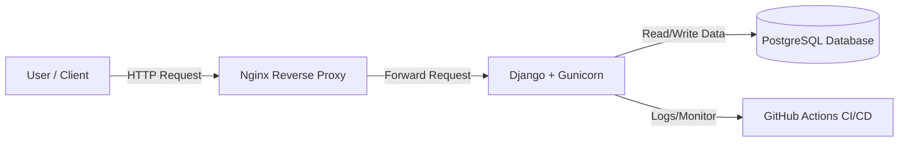

# 🚀 Cloud-Native Inventory Management API


A production-ready **3-Tier REST API** built with **Django** & **PostgreSQL**, containerized with **Docker**, served via **Nginx Reverse Proxy**, and deployed on **AWS EC2** with fully automated **CI/CD pipelines**.

---

## 🏗 Architecture

The system follows a 3-tier, container-based architecture orchestrated by **Docker Compose**:



---

## 🌟 Key Features

- **Containerization:** Fully Dockerized environment (Web, DB, Nginx) ensuring consistency across Dev and Prod.
- **Reverse Proxy:** Nginx configured as a secure gateway and static file handler.
- **CI/CD Automation:** GitHub Actions pipeline triggers on every push to build and deploy Docker images.
- **Database Persistence:** Uses Docker Volumes to persist PostgreSQL data.
- **Optimization:** Configured swap memory on AWS EC2 (t2.micro) to prevent OOM crashes.
- **Resilience:** Healthchecks to prevent race conditions between Django and PostgreSQL.
- **Dynamic DNS:** Integrated with DuckDNS for consistent domain access.

---

## 🛠 Tech Stack

- **Backend:** Python, Django REST Framework  
- **Server:** Gunicorn (WSGI)  
- **Database:** PostgreSQL 13  
- **Infrastructure:** AWS EC2 (Ubuntu 22.04 LTS)  
- **DevOps / Tooling:** Docker, Docker Compose, GitHub Actions, Nginx, Linux Administration  

---

## ⚙️ Installation & Local Setup

### ✅ Prerequisites

- **Docker** & **Docker Compose** installed  
- **Git** installed  

### 1️⃣ Clone the repository

```bash
git clone https://github.com/official-noman/django-docker-aws-cicd.git
cd django-docker-aws-cicd
```

### 2️⃣ Create Environment Variables

Create a `.env` file in the project root:

```env
SECRET_KEY=dev-secret-key
DEBUG=True
DB_NAME=devops_inventory
DB_USER=hello_django
DB_PASSWORD=supersecret
DB_HOST=db
DB_PORT=5432
ALLOWED_HOSTS=*
```

### 3️⃣ Build and Run Containers

```bash
docker-compose up -d --build
```

### 4️⃣ Apply Database Migrations

```bash
docker-compose exec web python manage.py migrate
```

### 5️⃣ Access the API

- Health Check: `http://localhost/api/health/`
- Product Inventory: `http://localhost/api/products/`

---

## 🚀 API Endpoints

| Method | Endpoint          | Description                               |
|--------|-------------------|-------------------------------------------|
| GET    | `/api/health/`    | Check system status (DevOps health check) |
| GET    | `/api/products/`  | Retrieve list of all products             |
| POST   | `/api/products/`  | Create a new product (JSON body required) |

### Sample JSON for `POST /api/products/`

```json
{
  "name": "Gaming Laptop",
  "price": "120000.00",
  "quantity": 5
}
```

---

## ☁️ Deployment Details (AWS)

This project is deployed on an **AWS EC2 t2.micro** instance.

### Optimization for Low Memory (1GB RAM)

To handle the load of 3 containers on a free-tier instance, a **2GB swap file** was configured:

```bash
sudo fallocate -l 2G /swapfile
sudo chmod 600 /swapfile
sudo mkswap /swapfile
sudo swapon /swapfile
```

### Nginx Configuration

Nginx is set up to:

- Listen on **Port 80**
- Forward traffic to the Django container on **Port 8000** using `proxy_pass`

---

## 👨‍💻 Author
**Abdullah Al Noman**  
```
